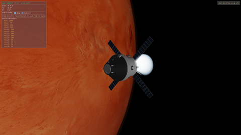
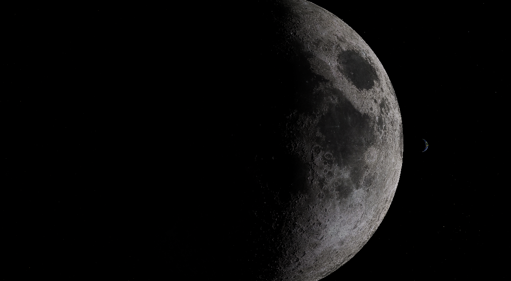

# Apeiron

*ἄπειρον* — Anaximander's word for the boundless, unlimited substrate of the universe.

Apeiron is a physically-correct space simulator built from first principles: real ephemeris data, physically-based rendering, and — eventually — a full orbital mechanics engine for spacecraft navigation and maneuver planning. The goal is a simulator where every number means something: planetary positions from SPICE kernels, atmospheric scattering from measured optical parameters, and orbital burns computed against real dynamics.

---

## Screenshots


*Orion firing the main engine at Mars periapsis — orbit insertion burn with Mars filling the frame*


*Orion approaching the ISS — docking MFD with live cam view, alignment cues, and relative velocity readout*


*Earthrise seen from the moon on 20260407, around the same time Artemis II turned back to earth from behind the moon*

[Full gallery](docs/GALLERY.md)

---

## What works today

### Interplanetary missions

The simulator supports end-to-end interplanetary missions. An Earth→Mars transfer has been flown:

- **Transfer MFD** plans the heliocentric transfer: departure C3, arrival hyperbolic excess velocity, B-plane targeting, and Mars orbit insertion (MOI) ΔV
- Departure epoch is chosen near an actual Earth–Mars launch window; SPICE ephemeris drives all body positions
- **Hyperbolic approach** with live B-plane display (Pe, BPL ΔV, T-to-Pe, MOI ΔV, T-ignition); readouts persist and transition gracefully through the elliptic capture
- **N-body dynamics** with tidal correction: Sun, Earth, Mars (and all configured bodies) all contribute gravity; dominant-body–relative tidal correction keeps orbits stable across the solar system without switching frames
- After MOI, **MapMFD** shows the spacecraft's ground track over the Mars surface texture with multi-orbit lookahead

### Solar system bodies
- All eight planets + Moon, Phobos, Deimos rendered at SPICE-correct positions
- Positions and orientations from **NASA/NAIF SPICE kernels** (DE440s + planetary PCK)
- Physically correct **oblate spheroids** (tri-axial ellipsoid radii from PCK)
- High-resolution real texture maps (8K for Earth, Mars, Moon, Jupiter, Saturn, …)
- Normal mapping and specular mapping (Earth)
- **Displacement / tessellation LOD** — MOLA DEM for Mars, LOLA DEM for Moon; height displaced on the GPU via tessellation shaders with view-distance LOD
- **Irregular mesh bodies** — Phobos and Deimos rendered from real shape models (OBJ)
- Cloud layer (Earth)

### Atmospheric scattering
Bruneton & Neyret single-scattering model, precomputed at load time:

- **Transmittance LUT** (256×64 RGBA32F) filled by a Vulkan compute shader; parameterised by altitude and cos(zenith)
- Per-body atmosphere parameters (Rayleigh β per wavelength, Mie β, scale heights, Henyey-Greenstein g)
- **Earth** — Bruneton 2017 Table 1 parameters; characteristic blue limb glow and terminator haze
- **Mars** — thin CO₂ atmosphere with dust-reddened scattering; reddish/orange limb glow
- Physically correct single-scattering integration (16 steps) with LUT-based sun transmittance lookup
- Blend equation: `result = L_inscatter + background × transmittance` (non-standard Vulkan src=One, dst=SrcAlpha)
- ImGui **Atmosphere LUT inspector** — real-time view of the transmittance texture per planet with altitude/zenith tooltip

### Ring system
- Saturn's ring system rendered from a real ring texture (alpha channel encodes opacity profile)
- **Lommel-Seeliger scattering** model — physically motivated single-particle BRDF for regolith surfaces
- Correct **opposition surge** — brightening when the sun is directly behind the observer

### Rendering pipeline
- **Vulkan** renderer (Vulkan-Hpp, vk-bootstrap, Vulkan Memory Allocator)
- HDR render pass with **bloom post-process** (threshold + Gaussian blur, two-pass)
- **Tone mapping** (Reinhard) in a final fullscreen pass
- Exposure control
- **Star field** — HYG Database v4.2 (~120 000 stars), spectral colour from B−V index, rendered as calibrated point sprites
- Depth-correct rendering order: stars → planets → atmosphere shells → rings
- Depth test on / depth write off for transparent layers (atmosphere, rings)

### Universe & camera
- **64-bit double precision** positions throughout; camera-relative float only at the GPU boundary
- **Origin recentering** each frame — floating origin stays near the camera, preventing float precision loss at large distances
- SPICE-driven simulation time with adjustable speed (seconds/second)
- Click-to-focus body selection; orbital camera (azimuth/elevation/distance)
- Distance display in km and AU

### Spacecraft — Orion CSM/ESM

- **Orion CM+SM** rendered from a glTF model with full PBR materials
- **41 RCS / ACS thrusters** loaded from a TOML manifest — positions, directions, thrust, type (RCS / AUX / MAIN)
- **Control effectiveness matrix** (6×N, pseudoinverse via Jacobi SVD) allocates per-thruster throttles from a desired 6-DOF wrench
- **PWM firing simulation** — duty-cycle modulation per thruster, minimum duty-cycle cutoff to suppress noise
- **Exhaust plumes** — cone mesh scaled by throttle, additive blending
- **Docking ports** — named glTF nodes exposed as attach points; port-to-port distance measurement in the nav console

### Docking system

- **ISS model** loaded from glTF, placed on a user-defined orbit
- **Proximity ops nav mode** — dedicated view with range, closing rate, and alignment cues
- **IDSS-style capture sequence**: soft capture (cone-in-drogue alignment + contact detection) → hard capture (rigid weld); release applies a separation impulse and returns to *Unarmed* state to prevent immediate re-capture
- **Docking MFD** — live offscreen camera view from a `cam_*` node on the model; Z+/Z− FOV zoom; overlaid guidance text (range, closing rate, alignment error)
- **Camera MFD** — dedicated MFD page for any onboard camera, cycles through all `cam_*` nodes; aspect-ratio-correct display with camera name overlay

### MFD suite

Five instrument displays are available in the navigation console, selectable from the MFD menu:

| MFD | Purpose |
|---|---|
| **ORB — Orbital** | Keplerian elements, period, apoapsis/periapsis, eccentricity for any reference body |
| **DOCK — Docking** | Live offscreen camera + range/closing-rate/alignment readouts for proximity ops |
| **CAM — Camera** | Cycles through all onboard `cam_*` nodes; aspect-correct with camera name overlay |
| **XFER — Transfer** | Interplanetary transfer planning: B-plane targeting, MOI ΔV, burn timing |
| **MAP — Ground Track** | Equirectangular world map with real planet texture, ground track (trail + lookahead), shadow overlay, terminator, sub-solar marker |

### Autopilots (GNC)

- **Kill Rotation** — parabolic bang-bang torque with timed-burn near settle; large-slew flag suppresses AUX thrusters
- **Attitude hold** (Prograde / Retrograde / Normal±) — quaternion error + rate damping, PD-style parabolic switch
- **NullV** — nulls relative velocity to docking target using RCS; authority computed from the actual pseudoinverse + throttle-clamped RCS solution so stopping estimates are accurate
- T-NV / D-NV readouts in nav console: estimated time and distance to zero relative velocity given current orientation

### N-body physics

Translation dynamics are integrated numerically (RKF78) with all configured solar system bodies as attractors:

- **Tidal correction** — each non-dominant body carries a `tidalRefPos` set to the dominant body's ECI position; the indirect term `GM·(r_body − r_dominant)/|…|³` cancels the dominant body's free-fall acceleration, leaving only the true differential tidal force
- Dominant body is determined each frame by highest `GM/r²` at the spacecraft position; `tidalRefPos` is updated automatically, so the correction is correct at Earth, at Mars, and anywhere else without manual configuration
- Without the correction, the solar gravity residual at Mars distance (~0.003 m/s²) would drain ~25 m/s per orbit and collapse any captured orbit within a few revolutions

### Offscreen rendering

- Per-MFD camera rendered to a 512×512 RGBA16F texture each frame (ping-pong for frames-in-flight)
- Textures registered with ImGui via `ImGui_ImplVulkan_AddTexture`; `Renderer::acquireFrame()` / `beginHDRPass()` split allows pre-pass insertion

### Developer tools
- **ImGui** dev view: FPS, exposure, bloom controls, simulation speed, camera info, body distance list
- Atmosphere LUT inspector with per-planet LUT display
- Displacement scale slider for DEM exaggeration

---

## Architecture overview

```
apeiron/
├── libs/
│   ├── astro/        # SPICE wrapper, time system, coordinate frames
│   ├── universe/     # Scene graph, body catalogue, SPICE ephemeris queries
│   ├── render/       # Vulkan renderer — pipelines, meshes, atmosphere, rings
│   └── spacecraft/   # Thruster manifest, control allocator, autopilots
├── apps/
│   └── apeiron/      # Main executable, MFDs, docking system, GLSL shaders
├── data/
│   ├── scenarios/    # scenario.toml — bodies, kernels, atmosphere params
│   ├── kernels/      # SPICE kernels (LSK, PCK, SPK)
│   ├── textures/     # Planet texture maps
│   ├── meshes/       # Phobos / Deimos shape models
│   └── spacecraft/   # Orion thruster manifest (TOML), glTF models
└── docs/             # Design notes, gallery
```

All physics is **C++ namespaced** under `apeiron::astro`, `apeiron::universe`, `apeiron::render`.

---

## Tech stack

| Concern | Choice |
|---|---|
| Language | C++23 |
| Build | CMake (monorepo) + vcpkg |
| Ephemeris | NASA/NAIF CSPICE |
| Astrodynamics | [astro](https://github.com/LarsFlaeten/astro) — in-house library: time systems (UTC/TDB/TT), coordinate frames (ICRF, ecliptic, body-fixed), SPICE integration, propagators |
| Math | GLM |
| Renderer | Vulkan (Vulkan-Hpp, vk-bootstrap, VMA) |
| Windowing | GLFW |
| UI | Dear ImGui |
| Atmosphere | Bruneton precomputed scattering (Vulkan compute) |
| Star catalog | HYG Database v4.2 |
| Shape models | TinyObjLoader |
| Spacecraft models | tinygltf (glTF 2.0 + PBR materials) |
| Thruster manifest | TOML++ |
| Testing | Catch2 |

---

## Building

### Prerequisites
- Vulkan SDK (glslc must be on PATH)
- CMake ≥ 3.25
- vcpkg (set `VCPKG_ROOT`)

```bash
cmake --preset default        # configures + fetches vcpkg dependencies
cmake --build build
./build/bin/apeiron
```

Shaders are compiled from GLSL to SPIR-V at build time by `glslc`; paths are baked in at compile time.

---

## Planned / backlog

### Spacecraft — visual

| Item | Notes |
|---|---|
| CM window lights at night | Interior glow visible on the dark side of orbit |
| Nav lights / strobes | Running lights + strobe; especially useful near ISS/docking |
| Ambient lighting from day/night side | Reduce ambient on Orion based on terminator position and planet distance |
| Shadows + thruster hull glow | Cast shadows on hull; plume light reflected on nearby surfaces |
| Auto-exposure on camera | Adapt exposure to scene luminance (bright Earth vs deep space) |

### Spacecraft — GNC / controls

| Item | Notes |
|---|---|
| Nav console thruster selector | Choose RCS-only or RCS+Aux for manual thrust commands |
| RVD autopilots | Station-keeping hold, approach corridor guidance |
| Trajectory MFD improvements | Lambert/Izzo solver, porkchop plot, gravity assists |

### MFD / UI

| Item | Notes |
|---|---|
| Orbit MFD fixup | Reference body input box not working; better ref-body illustration |
| Orbit sync MFD | New module (or extend Orbit MFD) — match orbit with a target body |
| Map MFD zoom/pan | Zoom into region of interest; polar projections |
| Transfer MFD generalisation | Departure planet is currently Earth-only; make configurable |
| CamMFD free-look | Right-drag slew (yaw/pitch) + FOV zoom independent of autopilot attitude |

### Docking

| Item | Notes |
|---|---|
| Docking audio / haptics | Contact sound, hard-capture clunk |
| Multi-port ISS | Expose all ISS docking ports; route-plan to correct port |

### Rendering / atmosphere

| Item | Notes |
|---|---|
| Multiple scattering | Adds ambient sky fill and inner-limb glow; requires 5-pass Bruneton precompute |
| Non-linear LUT parameterisation | Better horizon precision near grazing angles |
| Camera inside atmosphere | Interior sky rendering for surface/low-orbit views |
| Terrain geometry clipmaps | Proland-style for continuous LOD from orbit to surface |
| Procedural textures | Noise-based fallback for bodies without real texture data |
| Gas giant atmospheres | Layered cloud-deck model; different from rocky-planet Bruneton |
| Venus atmosphere | Extremely thick CO₂; needs higher integration step count |
| Galilean moons | Requires large SPK satellite kernel (~1.1 GB) |

### Physics

| Item | Notes |
|---|---|
| SOI-switching integration frames | At sphere-of-influence boundary, transform state into the new dominant body's frame (patched-conics approach); replaces the current tidal-correction approximation; two-level (Sun/planet) ~2–3 days, full hierarchy with moons more |
| J2 / oblateness perturbation | First zonal harmonic for more accurate low orbits |
| Atmospheric drag | Simple exponential density model; needed for LEO lifetime estimates |

### Long-term

| Item | Notes |
|---|---|
| Spacecraft — custom ship | Lifting-body multirole vessel: reentry, hover, landing, docking, space elevator |
| Spacecraft — articulation | Engine pod swing, landing leg deploy via glTF animation or runtime bone control |
| Utility drone / ROV | Astrobee-sized cold-gas vehicle for inspection and proximity ops |
| Drone Cradle Interface (DCI) | Flush hull mount: hatch animation, latch/release, 28V charge, SpaceWire data |
| LEON3 HIL integration | OBC emulator running real GNC software against live sim |

---

## References

- [NASA/NAIF SPICE](https://naif.jpl.nasa.gov/) — ephemeris and coordinate frames
- [Bruneton & Neyret 2008 / 2017](https://ebruneton.github.io/precomputed_atmospheric_scattering/) — precomputed atmospheric scattering
- [HYG Star Database](https://github.com/astronexus/HYG-Database) — 120 k stars with spectral data
- [Lommel-Seeliger scattering](https://en.wikipedia.org/wiki/Lommel%E2%80%93Seeliger_law) — regolith BRDF for rings and airless bodies
- [Proland](https://proland.inria.fr/) — terrain LOD and atmosphere research (future terrain reference)
