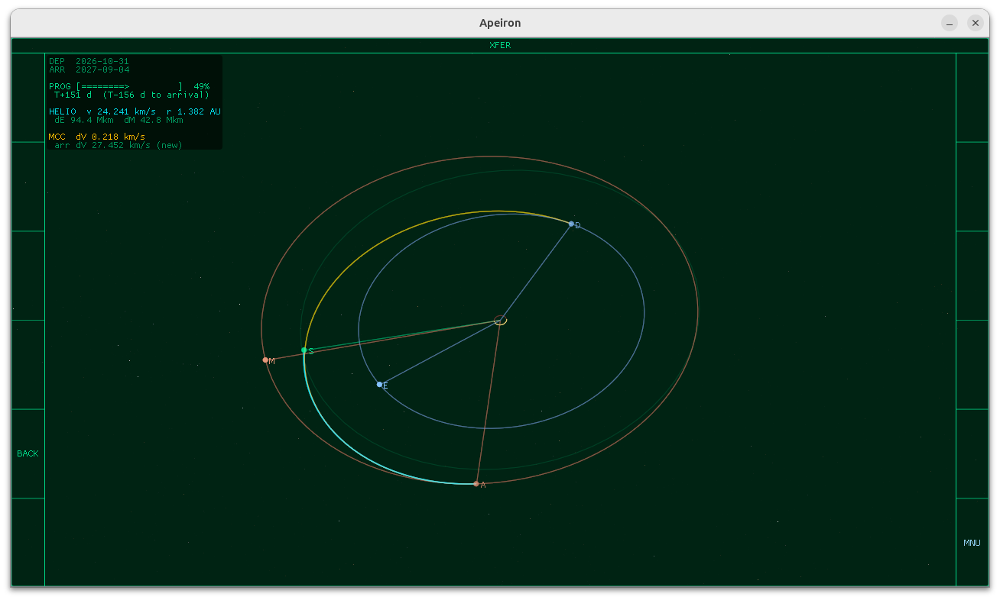
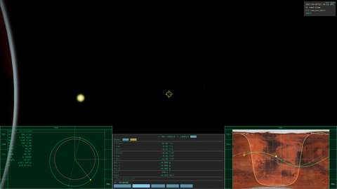
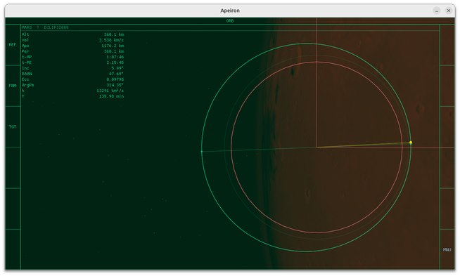
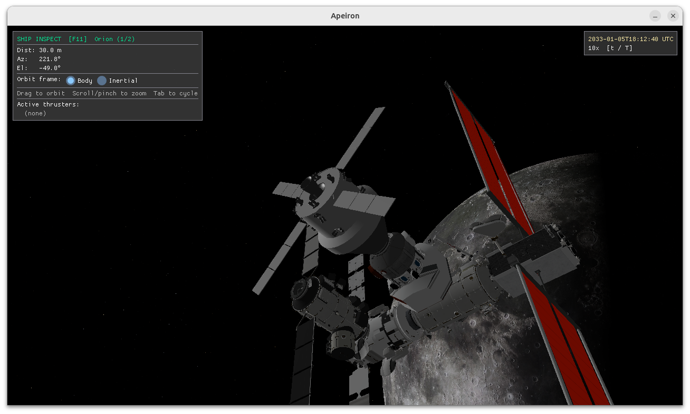

# Gallery

## Interplanetary — Earth to Mars

*Mid-cruise transfer orbit plot — Earth departure and Mars arrival orbits with the transfer ellipse*

*Orion firing the main engine at Mars periapsis — orbit insertion burn with Mars filling the frame*

*Navigation console in Mars orbit: Orbital MFD (left), MapMFD ground track over Mars surface (right)*

*Orbital MFD showing stable circular orbit after capture*

## Lunar — Gateway NRHO

*Orion hard-captured to Gateway in the Near Rectilinear Halo Orbit — Moon filling the background*

## Docking

*Orion approaching the ISS — docking MFD active with live cam view, alignment cues, and relative velocity readout*

*Orion hard-captured to the ISS docking port*

## Solar System

*Earthrise seen from the moon on 20260407, around the same time Artemis II turned back to earth from behind the moon*

*Mars with dust-reddened atmosphere — reddish-orange limb characteristic of iron-oxide aerosols*

*Earth with Bruneton single-scattering atmosphere — blue limb glow and terminator haze*

*Saturn's ring system with Lommel-Seeliger opposition surge*
