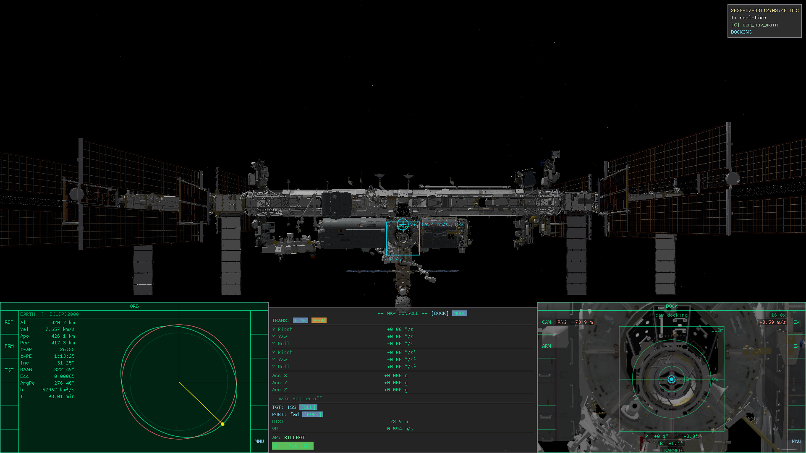
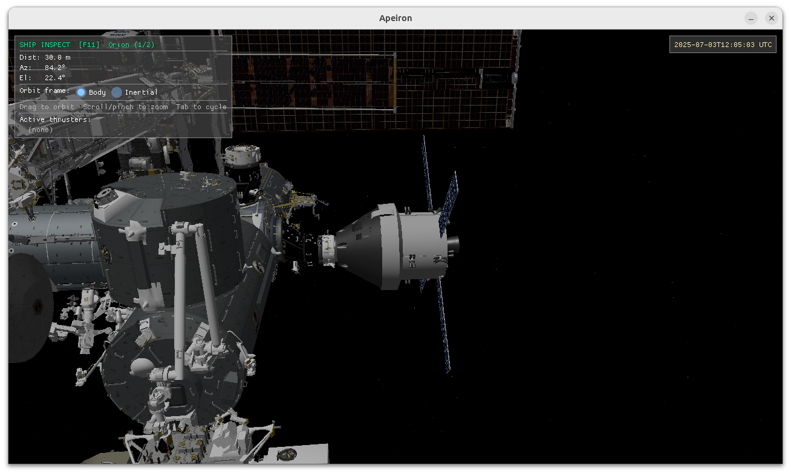
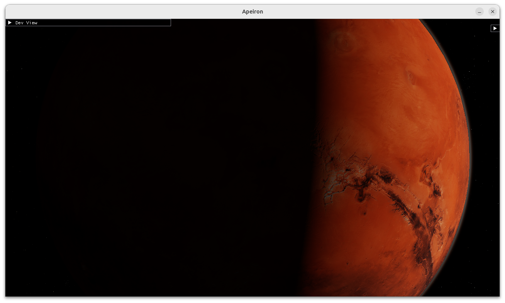
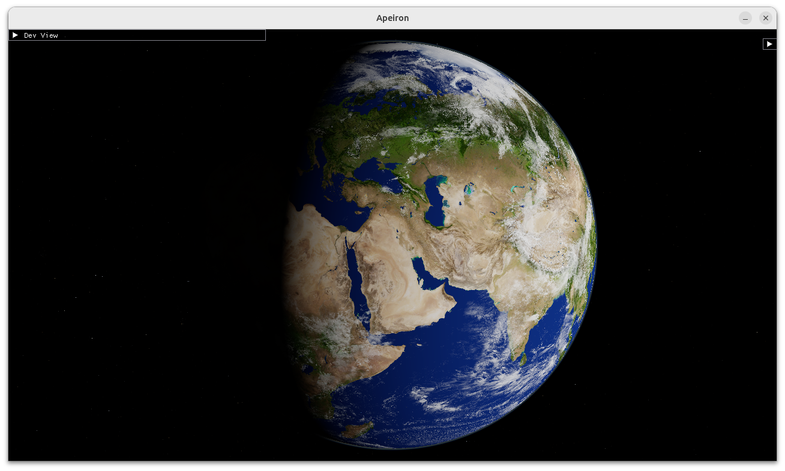
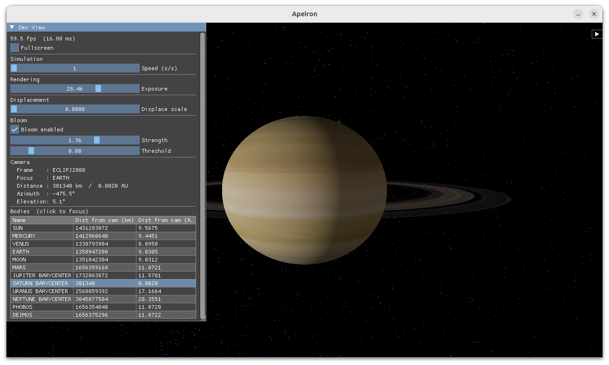

# Gallery

## Docking

*Orion approaching the ISS — docking MFD active with live cam view, alignment cues, and relative velocity readout*

*Orion hard-captured to the ISS docking port*

## Solar System

*Mars with dust-reddened atmosphere — reddish-orange limb characteristic of iron-oxide aerosols*

*Earth with Bruneton single-scattering atmosphere — blue limb glow and terminator haze*

*Saturn's ring system with Lommel-Seeliger opposition surge*
